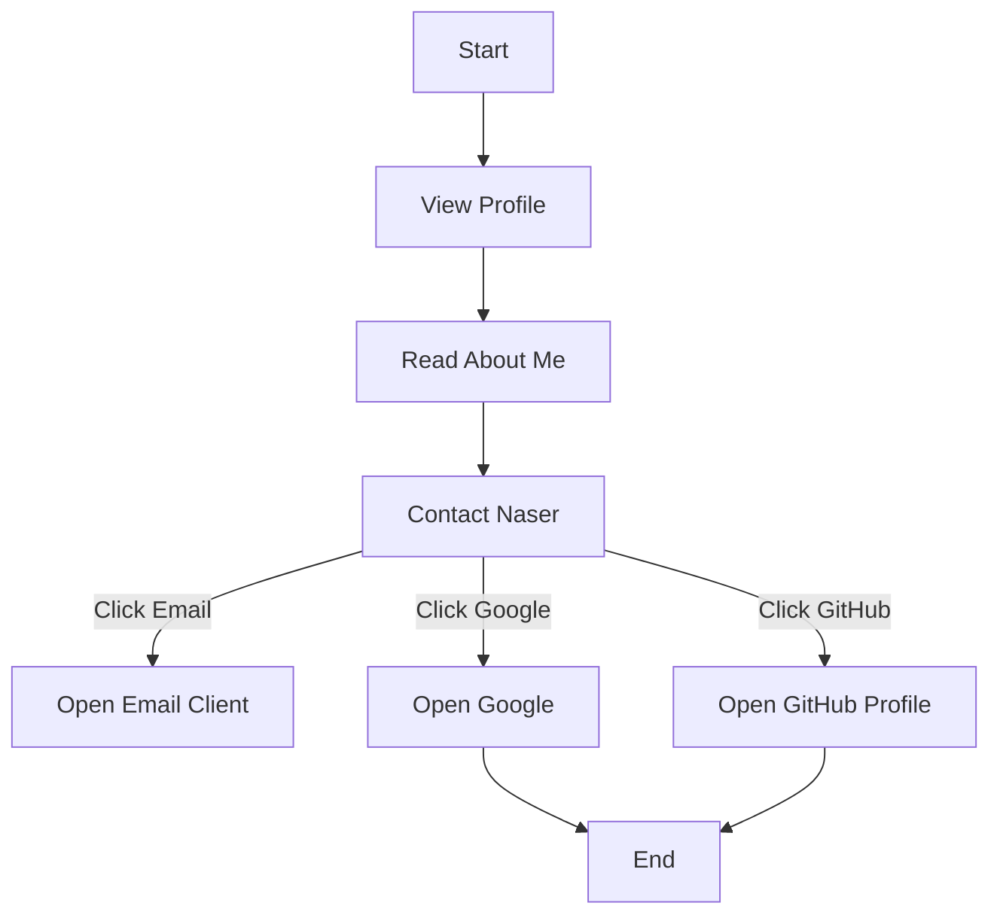

```markdown
# Developer Guide

## 1) Project Overview
This project is a personal portfolio website for Naser Aljed, showcasing his journey as a cybersecurity student. The website serves as an introduction to who Naser is, his interests, and provides contact information.

## 2) Language Used
- HTML: For structuring the webpage content.
- CSS: For styling and layout of the webpage.

## 3) Website Purpose
The purpose of this website is to:
- Introduce Naser Aljed as a cybersecurity student.
- Share insights about his interests in secure coding and CI/CD pipelines.
- Provide contact options and links to external sites, such as Google and Naser's GitHub profile.

## 4) User Flow

```
