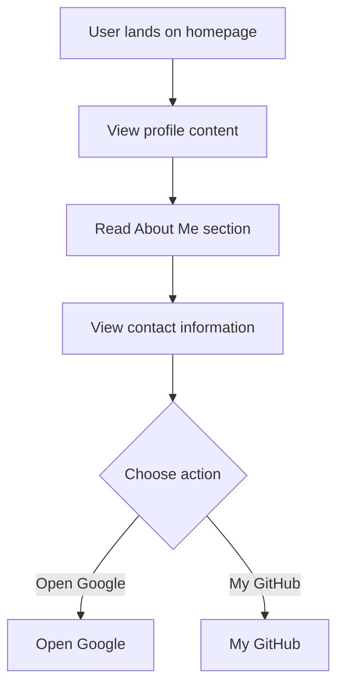

# Developer Guide

## 1. Project Overview
This project is a personal profile website for Naser Aljed, showcasing his journey as a Cybersecurity Student.

## 2. Language Used
The website is built using HTML and CSS.

## 3. Website Purpose
The purpose of the website is to present Naser Aljed's profile, his interests in cybersecurity, and ways for visitors to contact him and explore his GitHub.

## 4. User Flow

