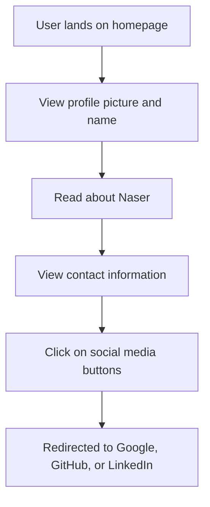

# Developer Guide

## 1) Project Overview
This project is a personal portfolio website for Naser Aljed, a cybersecurity student. The website showcases Naser's profile, interests in cybersecurity, and provides links to contact information and social media profiles.

## 2) Language Used
- **HTML**: Structure of the website
- **CSS**: Styling and layout design

## 3) Website Purpose
The main purpose of the website is to serve as an online portfolio where Naser can present his background in cybersecurity, personal interests, as well as provide ways for potential employers or collaborators to contact him.

## 4) User Flow

