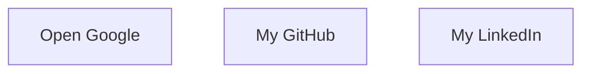

# Developer Guide

## 1. Project Overview
This project is a personal webpage for Naser Aljed, showcasing his profile as a Cybersecurity Student.

## 2. Language Used
- HTML
- CSS

## 3. Website Purpose
The website serves to introduce Naser Aljed, provide information about his interests in cybersecurity, and offer contact options.

## 4. User Flow

