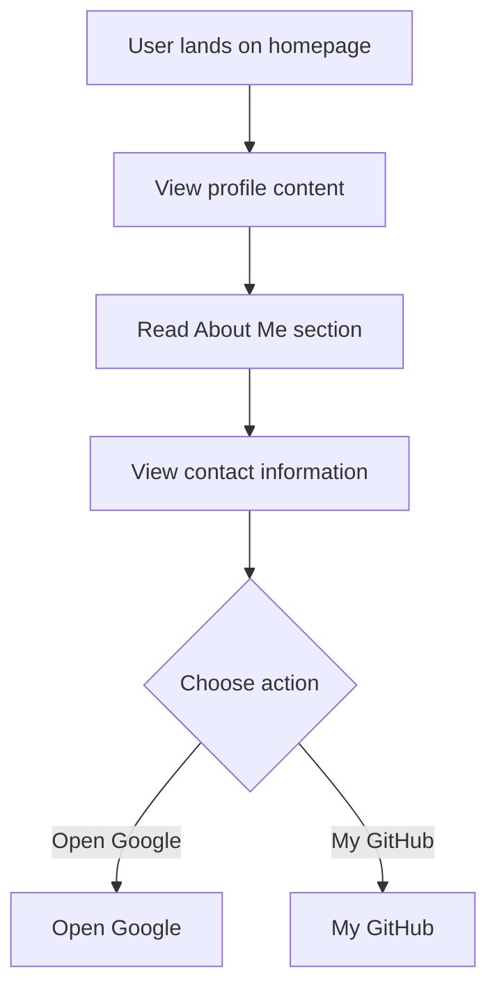

# Developer Guide

## 1. Project Overview
This project is a personal website for Naser Aljed, showcasing his background as a cybersecurity student and providing contact information.

## 2. Language Used
The website is built using HTML and CSS.

## 3. Website Purpose
The purpose of the website is to present information about Naser Aljed, including his role as a cybersecurity student, a brief about him, and links for contact and social media.

## 4. User Flow

