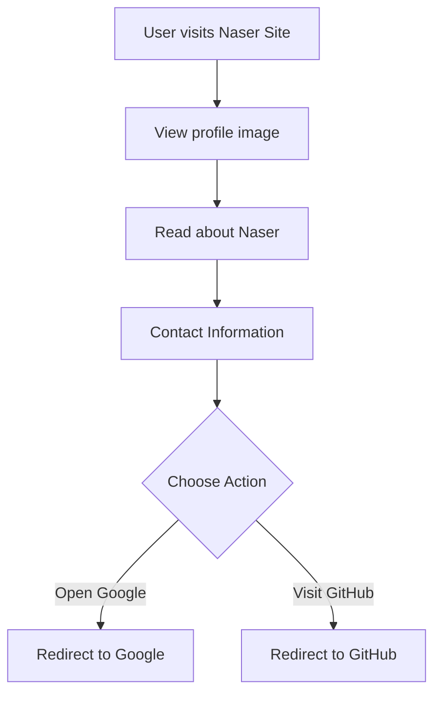

# Developer Guide for Naser Site

## 1. Project Overview
The Naser Site is a personal web page created by Naser Aljed, showcasing his journey as a cybersecurity student. The site serves as a portfolio and contact point, featuring both an introduction and links to external resources like Google and GitHub.

## 2. Language Used
- **HTML**: Structure of the web page
- **CSS**: Styling of the page elements for visual appeal

## 3. Website Purpose
The primary purpose of this website is to allow Naser to present himself and his work to others, enhance his online presence, and provide easy access to his contact information and social media profiles.

## 4. User Flow

