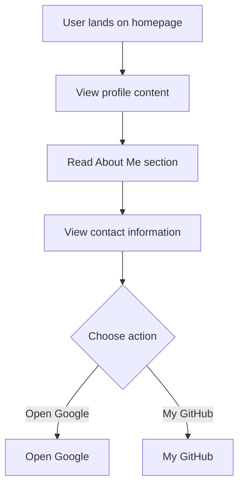

# Developer Guide

## 1. Project Overview
This project is a personal portfolio website for Naser Aljed, showcasing his journey as a Cybersecurity Student and providing contact information.

## 2. Language Used
The website is built using HTML and CSS.

## 3. Website Purpose
The website serves to introduce Naser Aljed as a Cybersecurity Student, share his interests in the field, and provide links to his GitHub and other resources.

## 4. User Flow

