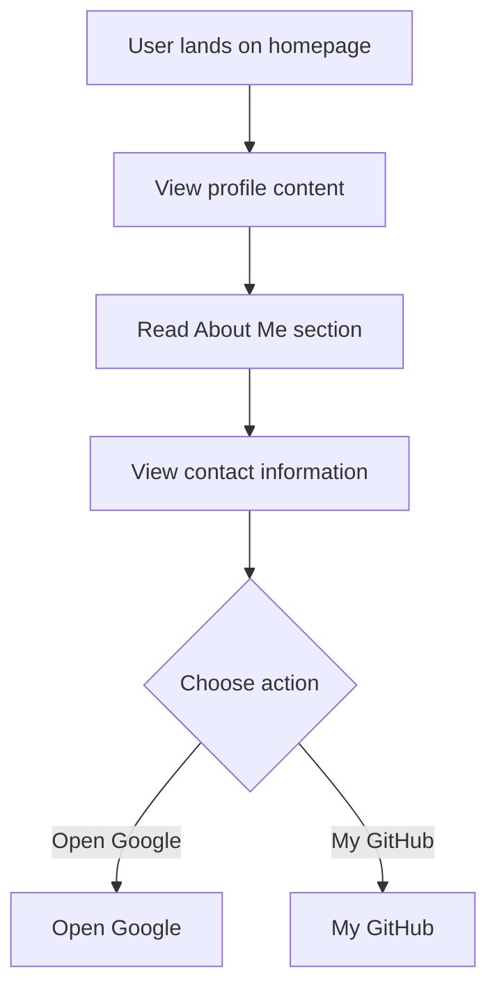

# Developer Guide

## 1. Project Overview
This project is a personal website for Naser Aljed, showcasing his interests and background in cybersecurity.

## 2. Language Used
This website is built using HTML and CSS.

## 3. Website Purpose
The purpose of the website is to provide a brief introduction to Naser Aljed as a cybersecurity student, share personal interests, and provide contact information. It also includes links to external resources such as Google and GitHub.

## 4. User Flow

