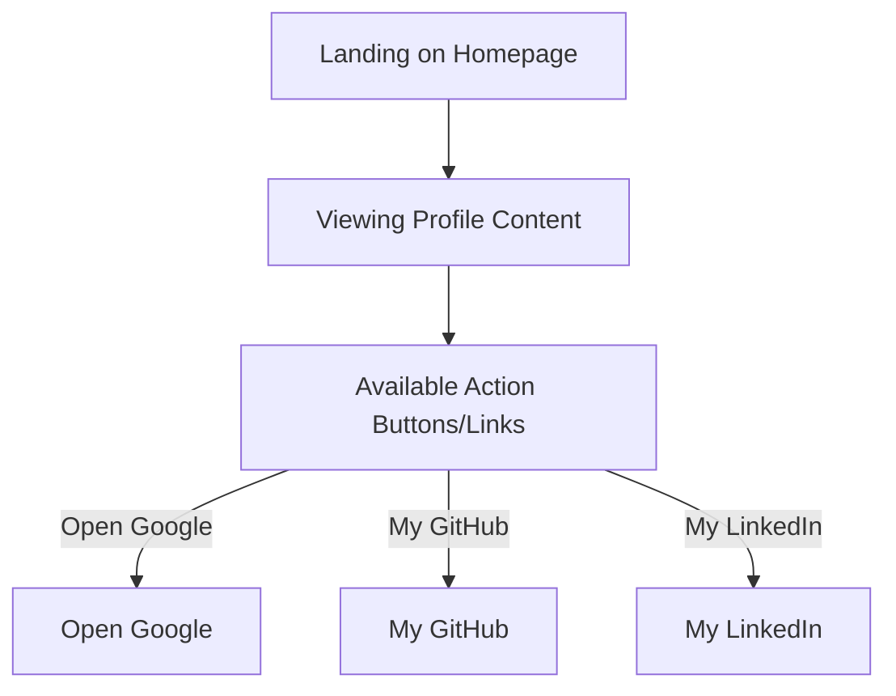

# Developer Guide

## 1. Project Overview
This project is a personal website for Naser Aljed, showcasing his profile as a Cybersecurity Student.

## 2. Language Used
The website is built using HTML and CSS.

## 3. Website Purpose
The purpose of the website is to present Naser Aljed, provide basic information about him, and link to his external profiles.

## 4. User Flow

