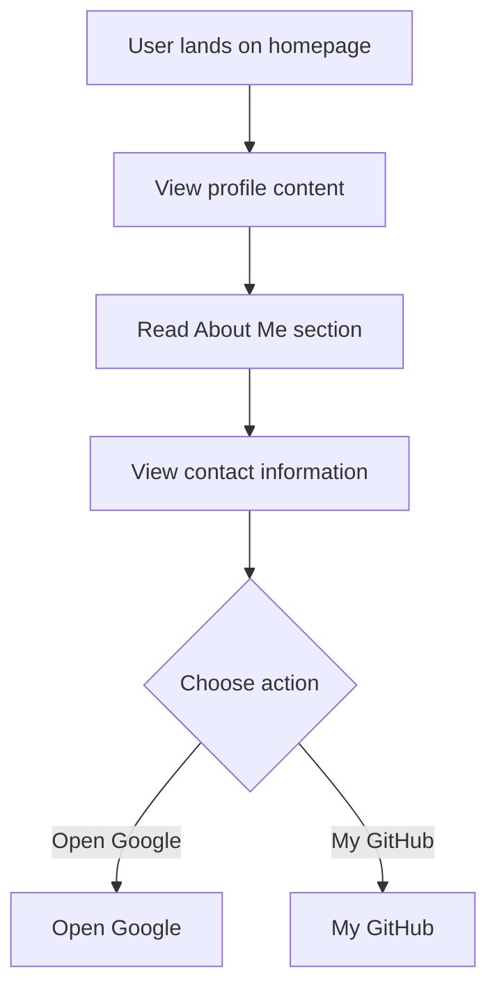

# Developer Guide

## 1. Project Overview
This project is a personal website for Naser Aljed, showcasing his identity as a Cybersecurity Student, with an emphasis on his ongoing learning and professional interests.

## 2. Language Used
The website is built using HTML and CSS.

## 3. Website Purpose
The website serves to present Naser Aljed's profile, including his role as a Cybersecurity Student, a brief biography, and contact information, while also providing links to external resources such as Google and GitHub.

## 4. User Flow

