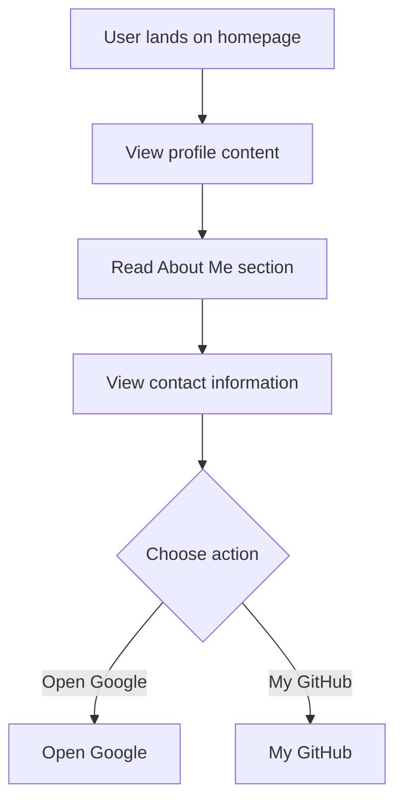

# Developer Guide

## 1. Project Overview
This project is a personal website for Naser Aljed, showcasing his profile as a Cybersecurity Student. It includes sections for an introduction, a brief about him, and contact information, along with links to external resources.

## 2. Language Used
The website is built using HTML and CSS.

## 3. Website Purpose
The purpose of the website is to present Naser Aljed's background in cybersecurity, highlight his interests, and provide contact information for networking opportunities. It also includes buttons to navigate to Google and his GitHub profile.

## 4. User Flow

