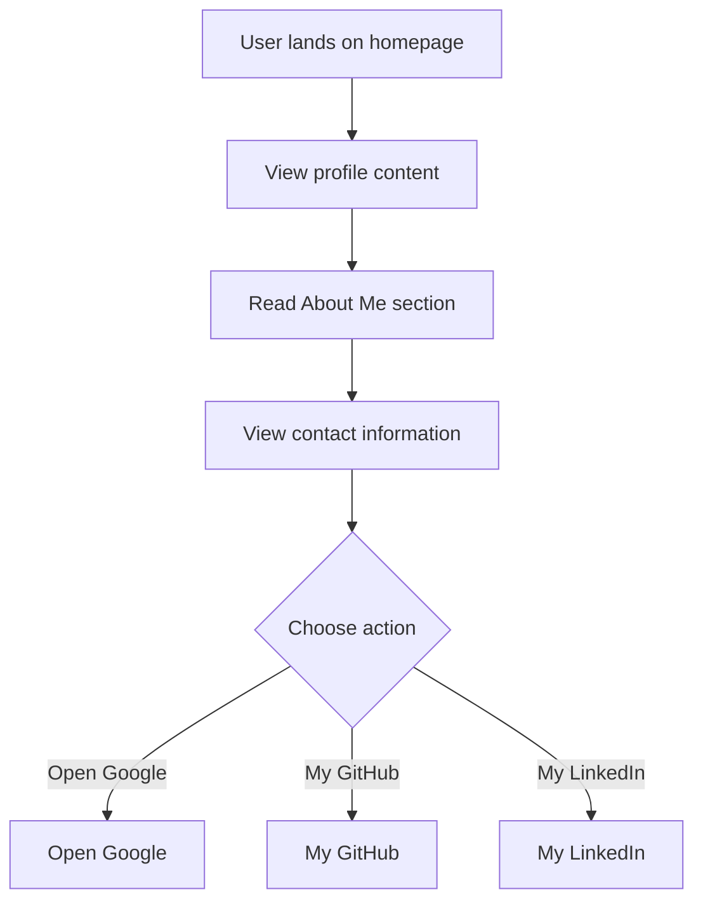

# Developer Guide

## 1. Project Overview
This project features a personal portfolio webpage for Naser Aljed, showcasing his profile as a Cybersecurity Student, including his interests and contact information.

## 2. Language Used
The website is built using HTML and CSS.

## 3. Website Purpose
The purpose of the website is to introduce Naser Aljed, highlight his studies in cybersecurity, and provide a means for contacting him. It also includes links to external resources such as Google and his GitHub profile.

## 4. User Flow

