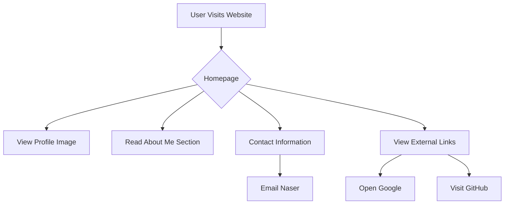

# Developer Guide

## 1) Project Overview
This project is a personal portfolio website for Naser Aljed, a cybersecurity student. It showcases Naser's profile, interests in cybersecurity, and provides links to external resources such as personal GitHub and Google.

## 2) Language Used
- HTML for structure and content
- CSS for styling and layout

## 3) Website Purpose
The purpose of the website is to present a brief introduction of Naser Aljed, including his educational focus on cybersecurity, while also providing contact information and links to relevant resources.

## 4) User Flow

