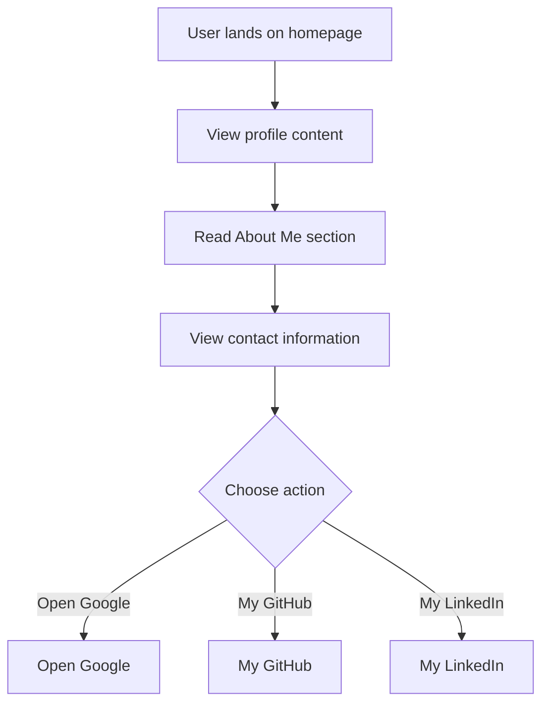

# Developer Guide

## 1. Project Overview
This project is a personal website for Naser Aljed, showcasing his journey as a Cybersecurity Student and providing information about himself and his interests.

## 2. Language Used
The website is built using HTML and CSS.

## 3. Website Purpose
The purpose of the website is to present information about Naser Aljed, including his role as a Cybersecurity Student, a brief description of his interests, and contact details. It also features links to external resources like Google, GitHub, and LinkedIn.

## 4. User Flow

