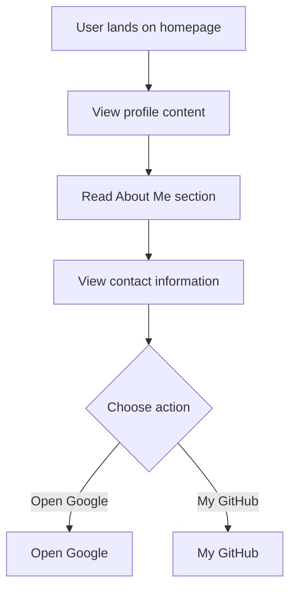

# Developer Guide

## 1. Project Overview
This project is a personal website showcasing the profile of Naser Aljed, a Cybersecurity Student. It includes information about Naser, his interests, and contact details.

## 2. Language Used
- HTML
- CSS

## 3. Website Purpose
The purpose of the website is to present personal information, educational background, and professional interests while providing links to external resources such as Google and GitHub.

## 4. User Flow

