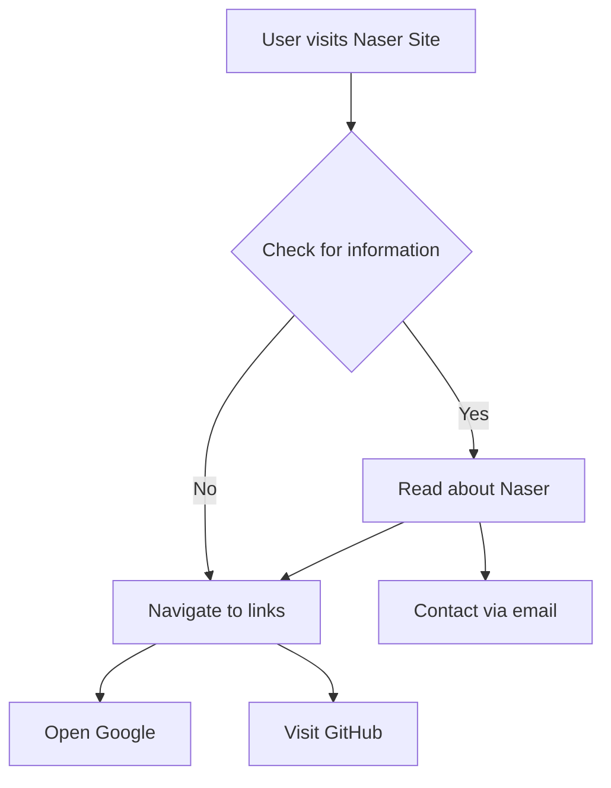

```markdown
# Developer Guide

## 1. Project Overview
The Naser Site is a personal webpage designed as an introduction to Naser Aljed, a cybersecurity student. The site showcases a brief biography, contact information, and links to external resources, including Google and GitHub.

## 2. Language Used
- **HTML**: Structure of the webpage
- **CSS**: Styling the webpage components for an appealing layout and design

## 3. Website Purpose
The purpose of the Naser Site is to provide a simple, personal introduction for Naser Aljed, highlighting his journey in cybersecurity and offering quick access to external sites that relate to his work and interests.

## 4. User Flow

```
