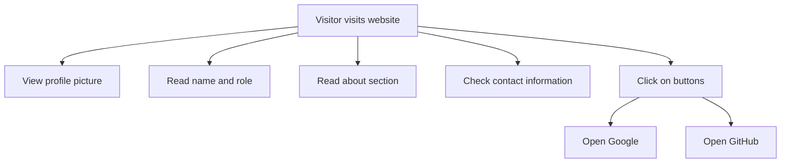

```markdown
# Developer Guide

## 1. Project Overview
This project is a simple personal website for "Naser Aljed," a cybersecurity student. The website serves as an online profile showcasing Naser's background, interests, and contact information. It includes links to external resources relevant to Naser's work and interests.

## 2. Language Used
- **HTML**: Structure and content of the webpage.
- **CSS**: Styling and layout of the webpage.

## 3. Website Purpose
The website aims to introduce Naser Aljed to visitors and provide information about his educational background in cybersecurity. It includes a brief about section and links to external sites like Google and GitHub for further exploration of his work.

## 4. User Flow

```
