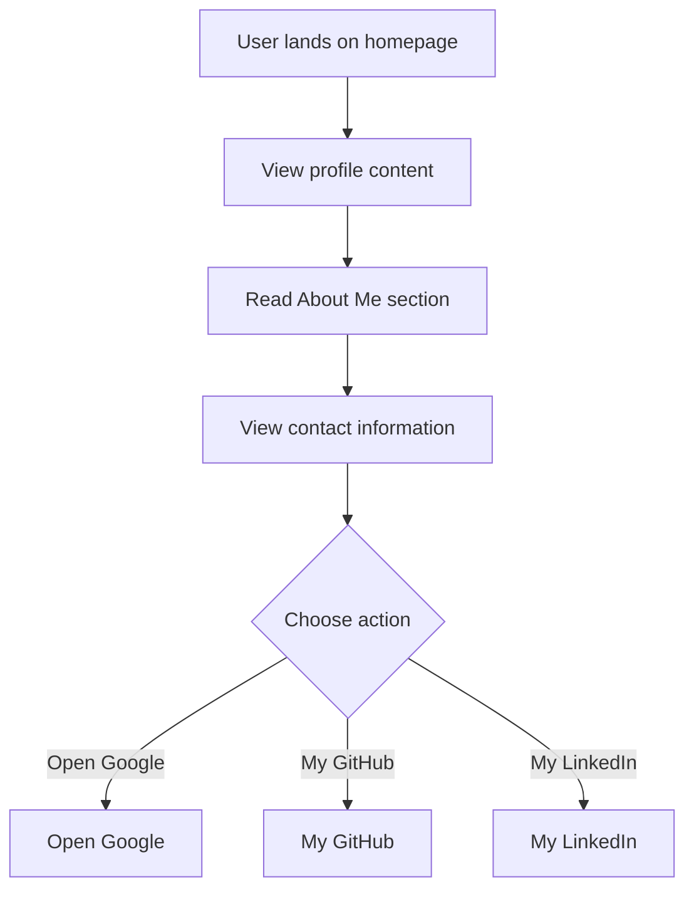

```markdown
# Developer Guide

## 1. Project Overview
This project is a personal website for Naser Aljed, showcasing his profile as a Cybersecurity Student. The site contains information about his interests and provides contact details.

## 2. Language Used
The website is built using HTML and CSS.

## 3. Website Purpose
The purpose of the website is to present Naser Aljed’s background in cybersecurity, highlight his interests in secure coding and CI/CD pipelines, and provide links to his contact information and social media profiles.
```

## 4. User Flow


