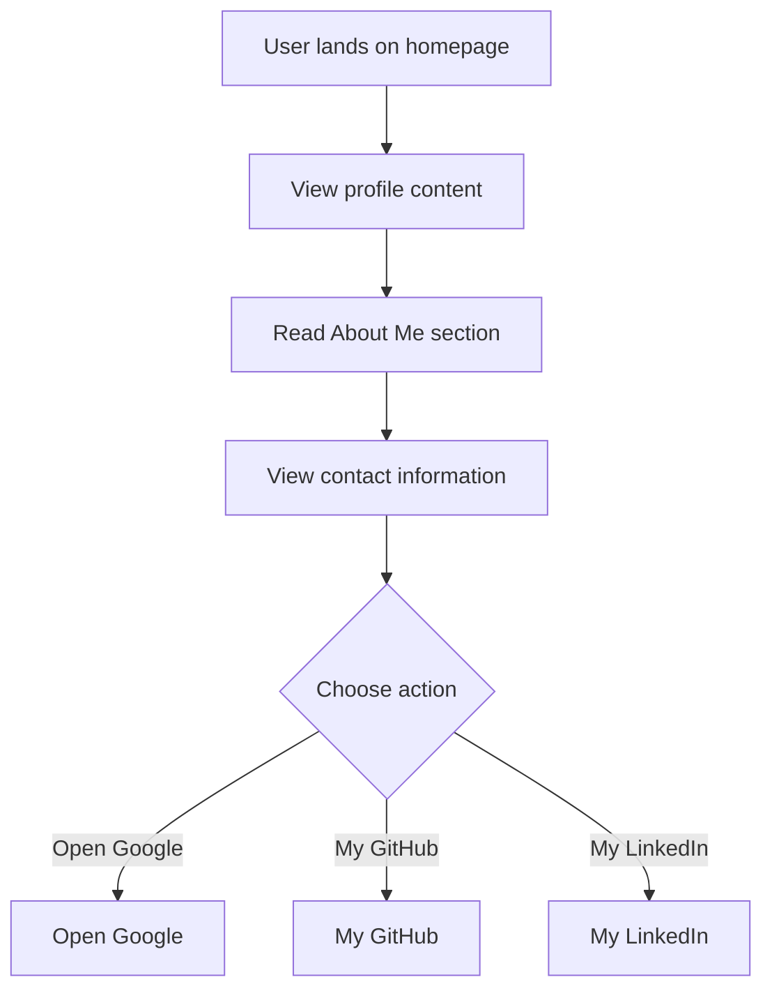

# Developer Guide

## 1. Project Overview
This project showcases a personal portfolio website for Naser Aljed, who is a Cybersecurity Student. It serves as an introductory platform highlighting his interests, skills, and contact information.

## 2. Language Used
The website is developed using HTML and CSS.

## 3. Website Purpose
The purpose of the website is to provide information about Naser Aljed, including his role as a Cybersecurity Student, a brief about him, and links to external resources such as Google and GitHub.

## 4. User Flow

