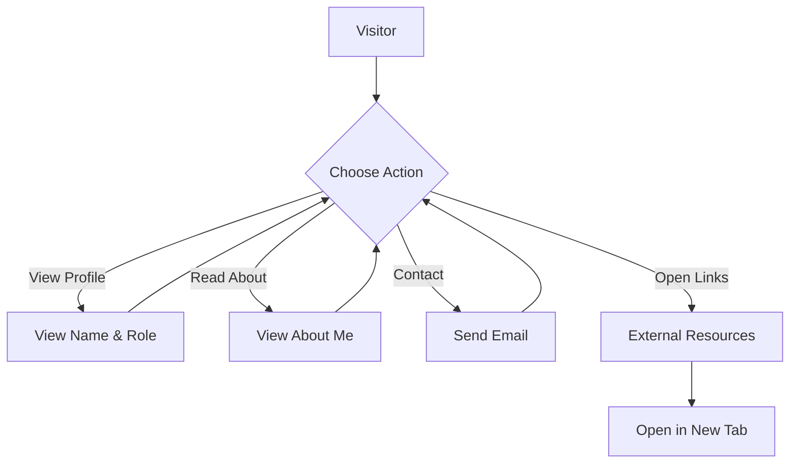

```markdown
# Developer Guide for Naser Site

## 1. Project Overview
Naser Site is a personal portfolio website developed by Naser Aljed, a cybersecurity student. It serves as a platform to showcase Naser's professional identity, interests in cybersecurity, and online presence through links to important resources.

## 2. Language Used
- **HTML**: For structuring the website.
- **CSS**: For styling the layout and visual elements.

## 3. Website Purpose
The purpose of the Naser Site is to:
- Provide information about Naser Aljed, including his educational background and interests.
- Display a professional profile image.
- Allow visitors to contact Naser through email.
- Offer quick access to external links, such as Google and Naser's GitHub profile.

## 4. User Flow

```
