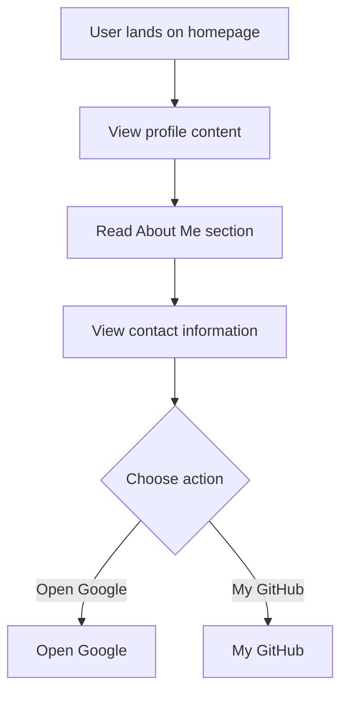

# Developer Guide

## 1. Project Overview
This project is a simple personal website for Naser Aljed, highlighting his status as a Cybersecurity Student. The website includes a profile image, an about section, and contact information, along with buttons linking to external resources.

## 2. Language Used
The website is built using HTML and CSS.

## 3. Website Purpose
The purpose of the website is to present Naser Aljed's profile, showcase his interests in cybersecurity, and provide contact options as well as links to external sites like Google and his GitHub repository.

## 4. User Flow

