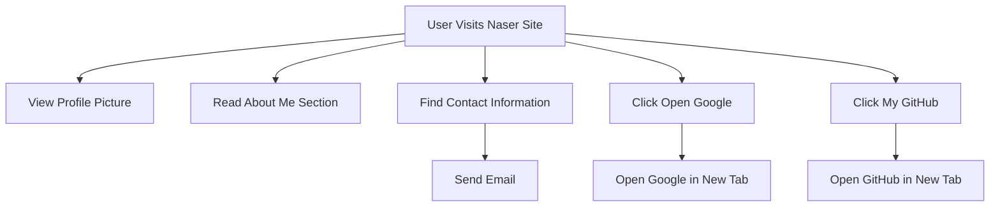

```markdown
# Developer Guide for Naser Site

## 1) Project Overview
Naser Site is a personal webpage created as an introductory portfolio for Naser Aljed, a cybersecurity student. The site showcases a basic design with personal information, including a profile picture, brief description, and links to external resources.

## 2) Language Used
- **HTML**: For content structure.
- **CSS**: For styling and layout.

## 3) Website Purpose
The primary purpose of the website is to serve as a personal introduction for Naser Aljed, allowing visitors to learn about his background in cybersecurity and access his external profiles, such as GitHub.

## 4) User Flow


``` 

This guide provides a brief overview, the technologies used, the site's purpose, and visualizes the user flow through a flowchart.
