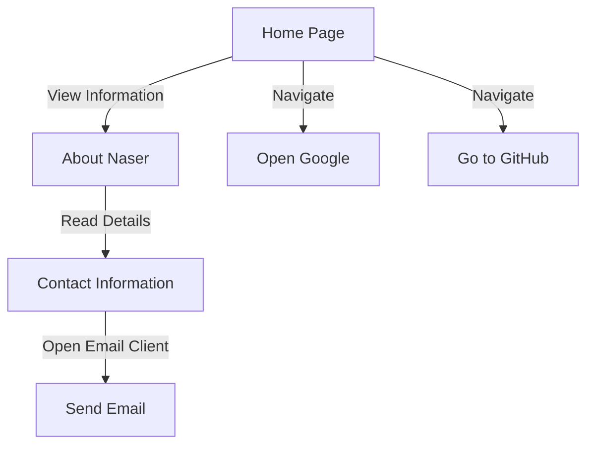

# Developer Guide

## 1. Project Overview
This project is a personal website created by Naser Aljed to showcase his journey as a cybersecurity student. The site features a simple layout and provides information about Naser, including his interests and contact details. It also includes buttons to navigate to external websites like Google and Naser's GitHub profile.

## 2. Language Used
- **HTML**: The structure of the website is built using HTML.
- **CSS**: Styling for the website is done using internal CSS.

## 3. Website Purpose
The primary purpose of this website is to serve as an online portfolio for Naser Aljed. It functions not only as a personal introduction but also as a platform for potential networking and visibility in the cybersecurity field. Visitors can learn about Naser, view his contact information, and explore his work on GitHub.

## 4. User Flow

