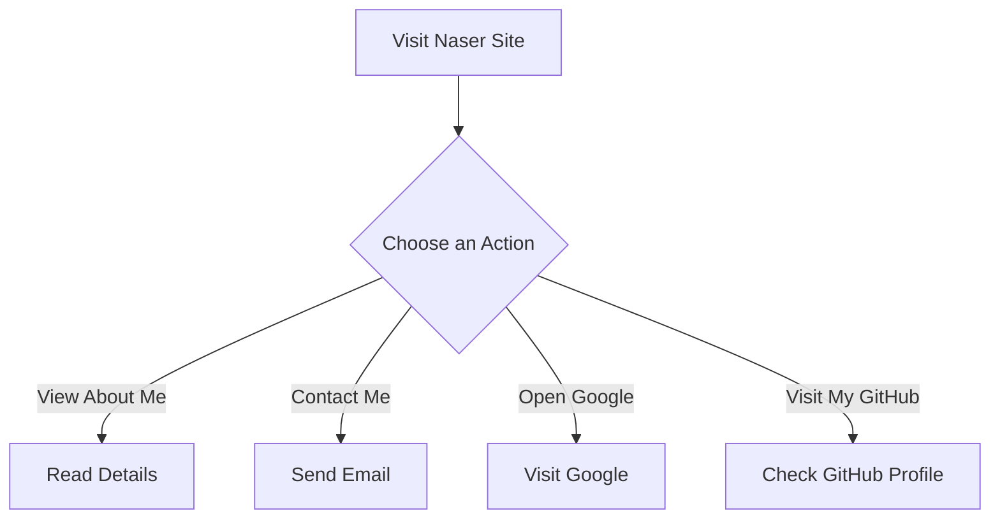

```markdown
# Developer Guide for Naser Site

## 1) Project Overview
Naser Site is a personal portfolio webpage created by Naser Aljed, aimed at showcasing his journey as a cybersecurity student. The site features a straightforward design that emphasizes personal information, contact details, and links to external resources. 

## 2) Language Used
- HTML: Structure of the webpage
- CSS: Styling and layout management

## 3) Website Purpose
The purpose of this website is to introduce Naser to visitors, provide information about his studies in cybersecurity, and offer easy access to his email and online profiles (Google and GitHub).

## 4) User Flow


```
