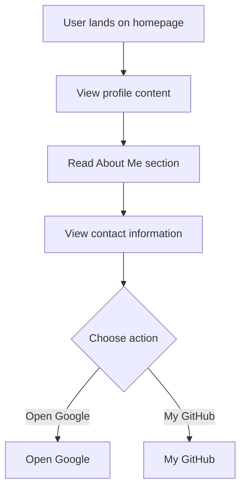

# Developer Guide

## 1. Project Overview
This project is a personal portfolio website designed for Naser Aljed, showcasing his journey and interests in cybersecurity.

## 2. Language Used
The website is built using HTML and CSS.

## 3. Website Purpose
The purpose of the website is to serve as an online profile for Naser Aljed, a Cybersecurity Student, where he shares information about himself, his interests, and provides contact details.

## 4. User Flow

