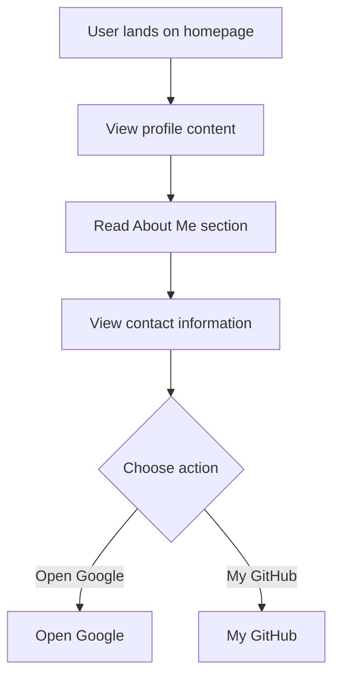

# Developer Guide

## 1. Project Overview
This project is a personal webpage for Naser Aljed, showcasing his journey as a Cybersecurity Student. It includes sections for an introduction, an "About Me" section, and contact information, along with links to Google and GitHub.

## 2. Language Used
The website is built using HTML and CSS.

## 3. Website Purpose
The purpose of this website is to present personal and professional information about Naser Aljed, including his studies in cybersecurity and links to his external profiles. It serves as a simple online portfolio.

## 4. User Flow

