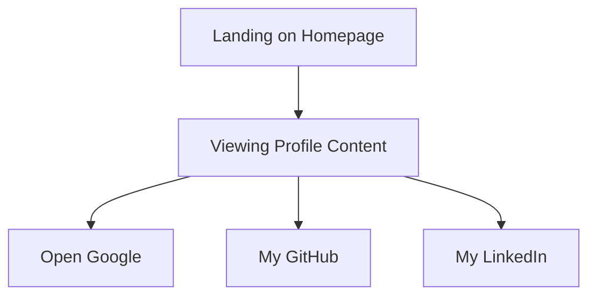

# Developer Guide

## 1. Project Overview
This project showcases a personal profile page for Naser Aljed, a Cybersecurity Student. It presents information about his background and provides links to external resources.

## 2. Language Used
- HTML
- CSS

## 3. Website Purpose
The website serves to introduce Naser Aljed, highlighting his role, interests, and providing contact information and links to external sites.

## 4. User Flow

