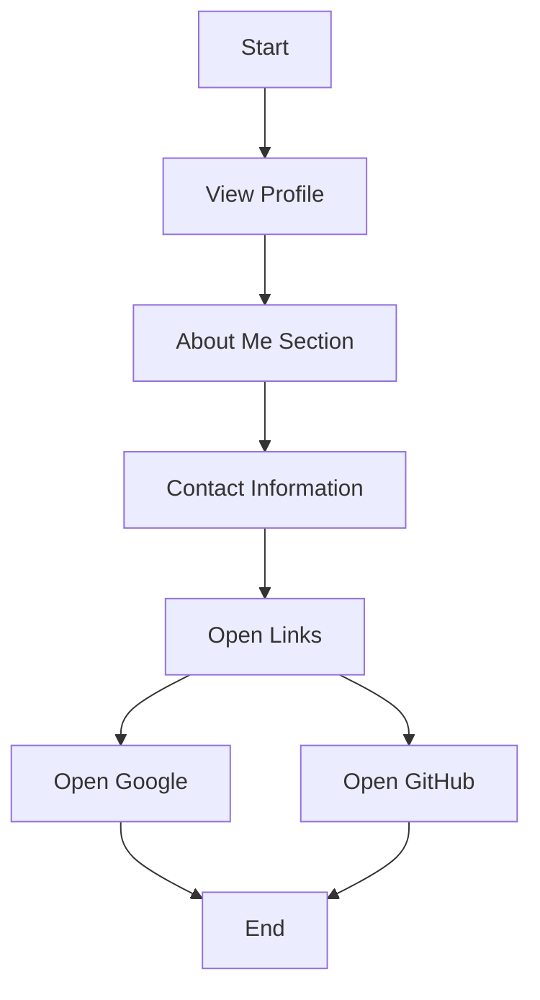

# Developer Guide

## Project Overview
This project is a personal portfolio website for Naser Aljed, a cybersecurity student. The website showcases Naser's profile, his interests in cybersecurity, and provides links to contact information and external resources.

## Language Used
- **HTML**: For structuring the website content.
- **CSS**: For styling the website, giving it a modern and visually appealing design.

## Website Purpose
The purpose of the website is to serve as a personal introduction to Naser Aljed, highlighting his background in cybersecurity. It includes information about his studies, interests, and provides easy access to contact him and view his work on GitHub.

## User Flow Flowchart

This flowchart illustrates the user journey from visiting the website to exploring the profile, reading about Naser, finding his contact info, and accessing external links.
