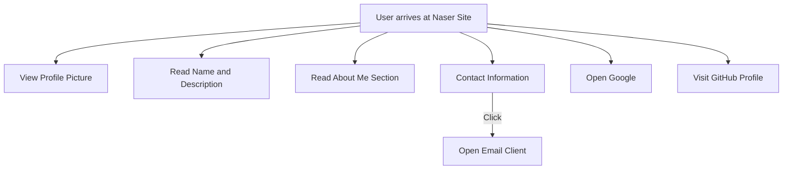

```markdown
# Developer Guide for Naser Site

## 1. Project Overview
Naser Site is a personal webpage that serves as an introduction to Naser Aljed. It showcases basic information about him, including his studies in cybersecurity, as well as links to his email and social media profiles.

## 2. Language Used
- **HTML**: Structure of the webpage
- **CSS**: Styling for layout, colors, and presentation

## 3. Website Purpose
The primary purpose of the Naser Site is to provide a simple and clean presentation of Naser Aljed's personal information, facilitate contact through email, and guide users to his GitHub profile.

## 4. User Flow


```
