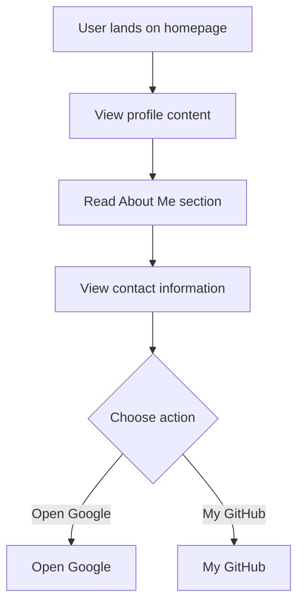

# Developer Guide

## 1. Project Overview
This project is a personal website for Naser Aljed, showcasing his journey as a cybersecurity student and providing contact options.

## 2. Language Used
- HTML
- CSS

## 3. Website Purpose
The website serves to introduce Naser Aljed as a cybersecurity student and to provide information about his interests and contact details.

## 4. User Flow

