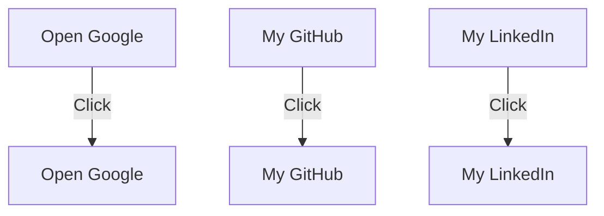

# Developer Guide

## 1. Project Overview
This project is a personal website for Naser Aljed, showcasing his profile as a cybersecurity student.

## 2. Language Used
- HTML
- CSS

## 3. Website Purpose
The purpose of this website is to introduce Naser Aljed, outline his interests in cybersecurity, and provide contact information alongside links to useful resources.

## 4. User Flow

