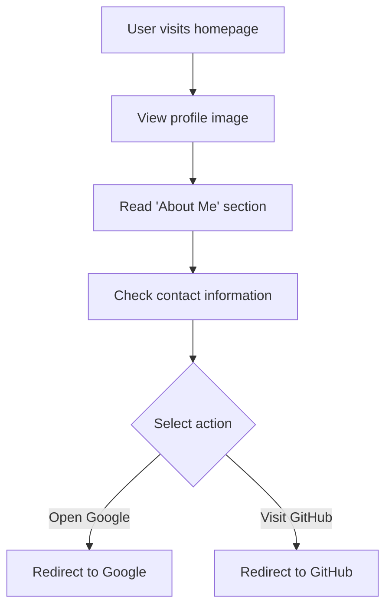

# Developer Guide

## 1. Project Overview
This project is a personal portfolio webpage designed for Naser Aljed, a cybersecurity student. It showcases Naser's interest in cybersecurity and provides contact information, as well as links to external resources like Google and GitHub.

## 2. Language Used
- **HTML** for structuring the content.
- **CSS** for styling the webpage.

## 3. Website Purpose
The purpose of this website is to serve as a personal landing page for Naser, where he can present himself to potential employers or collaborators in the cybersecurity field. It highlights his skills, interests, and provides means of contact.

## 4. User Flow

