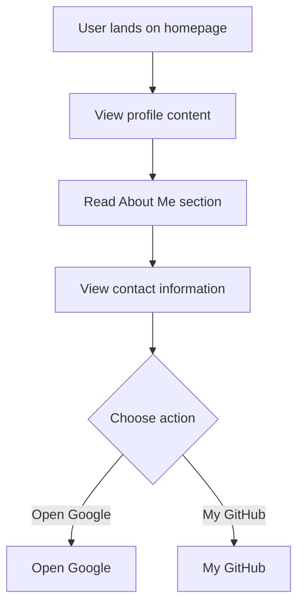

# Developer Guide

## 1. Project Overview
This project is a personal webpage for Naser Aljed, showcasing his journey as a Cybersecurity Student. The page includes a profile image, a brief introduction, and links to external resources.

## 2. Language Used
The website is built using HTML and CSS.

## 3. Website Purpose
The purpose of the website is to provide information about Naser Aljed's background in cybersecurity, his interests, and ways to contact him, as well as links to his Google and GitHub profiles.

## 4. User Flow

