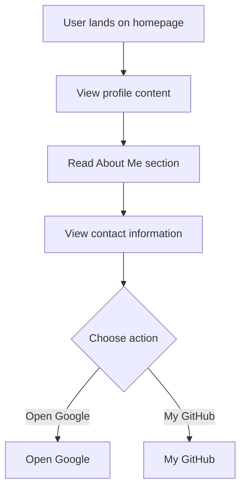

# Developer Guide

## 1. Project Overview
This project is a personal portfolio website for Naser Aljed, showcasing his journey as a cybersecurity student. The website includes sections about the individual, his interests, and links to external resources.

## 2. Language Used
The website is built using HTML and CSS.

## 3. Website Purpose
The purpose of the website is to present Naser Aljed's profile, including his role as a Cybersecurity Student, provide a brief overview of his interests, and offer contact information alongside links to external sites like Google and his GitHub profile.

## 4. User Flow

