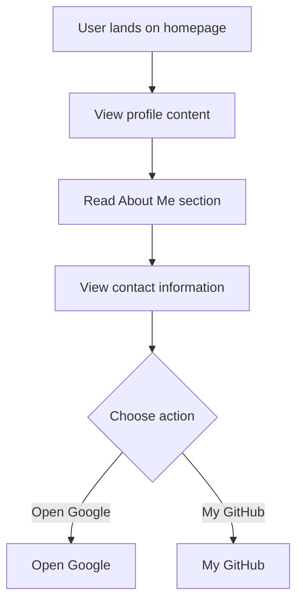

# Developer Guide

## 1. Project Overview
This project is a personal webpage for Naser Aljed, showcasing his identity as a Cybersecurity Student. The webpage features a visually appealing layout, a profile image, and sections detailing his interests and contact information.

## 2. Language Used
- HTML
- CSS

## 3. Website Purpose
The website serves as an introduction to Naser Aljed, providing information about his educational background in cybersecurity, interests in secure coding, and ways to contact him. It also includes links to external resources, such as Google and his GitHub profile.

## 4. User Flow

