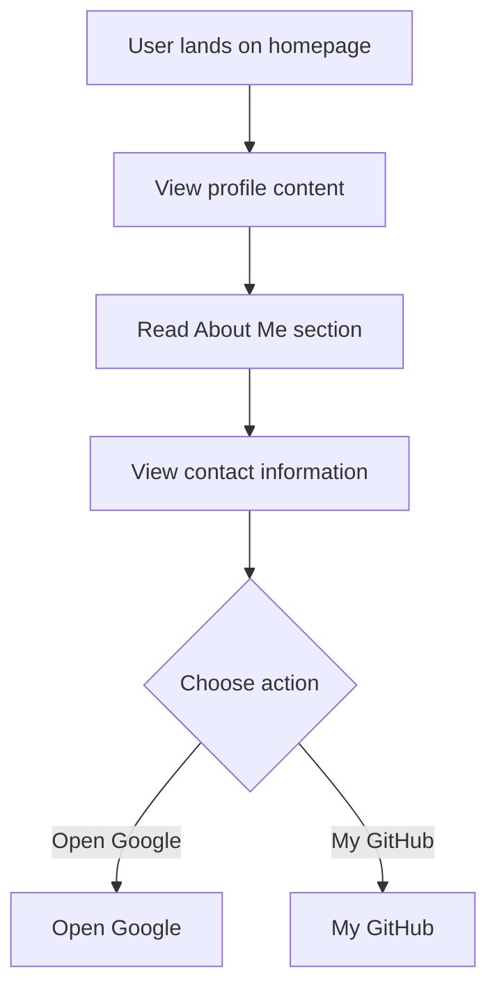

# Developer Guide

## 1. Project Overview
This project is a personal website for Naser Aljed, showcasing his journey as a Cybersecurity Student. It includes a brief introduction, contact information, and links to external resources.

## 2. Language Used
The website is built using HTML and CSS.

## 3. Website Purpose
The purpose of the website is to provide information about Naser Aljed, his interests in cybersecurity, and to facilitate contact through a provided email link. It also includes buttons that link to Google and Naser's GitHub profile.

## 4. User Flow

