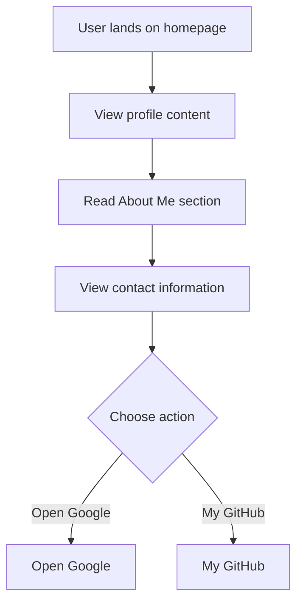

# Developer Guide

## 1. Project Overview
This project is a personal website for Naser Aljed, showcasing his profile as a Cybersecurity Student. It includes sections for an introduction, a brief about him, and contact information.

## 2. Language Used
The website is built using HTML and CSS.

## 3. Website Purpose
The purpose of the website is to present Naser Aljed's background in cybersecurity, highlight his interests in secure coding and CI/CD pipelines, and provide contact information along with links to external resources like Google and GitHub.

## 4. User Flow

```mermaid
flowchart TD
    A[User lands on homepage] --> B[View profile content]
    B --> C[Read About Me section]
    C --> D[View contact information]
    D --> E{Choose action}
    E -->|Open Google| OpenGoogle[Open Google]
    E -->|My GitHub| MyGitHub[My GitHub]
```
