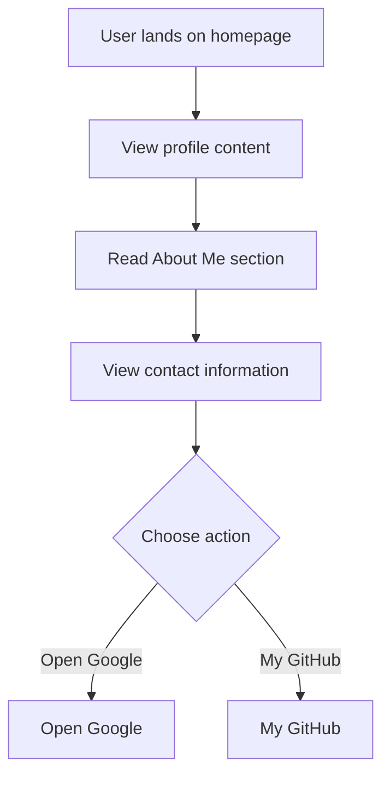

# Developer Guide

## 1. Project Overview
This project is a personal website for Naser Aljed, showcasing his profile as a Cybersecurity Student. It includes sections for a brief introduction, contact information, and links to external resources.

## 2. Language Used
The website is built using HTML and CSS.

## 3. Website Purpose
The purpose of the website is to provide information about Naser Aljed, his interests in cybersecurity, and ways to contact him. It also includes buttons to access external sites like Google and GitHub.

## 4. User Flow

```mermaid
flowchart TD
    A[User lands on homepage] --> B[View profile content]
    B --> C[Read About Me section]
    C --> D[View contact information]
    D --> E{Choose action}
    E -->|Open Google| OpenGoogle[Open Google]
    E -->|My GitHub| MyGitHub[My GitHub]
```
